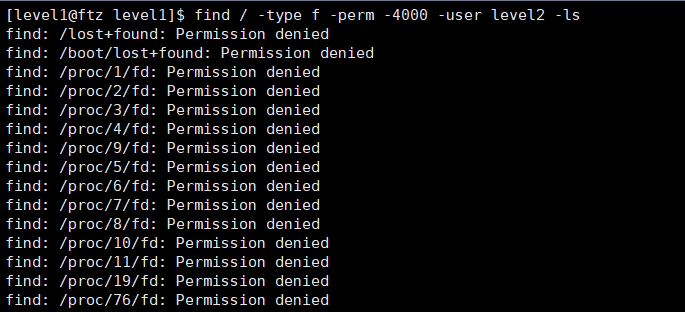
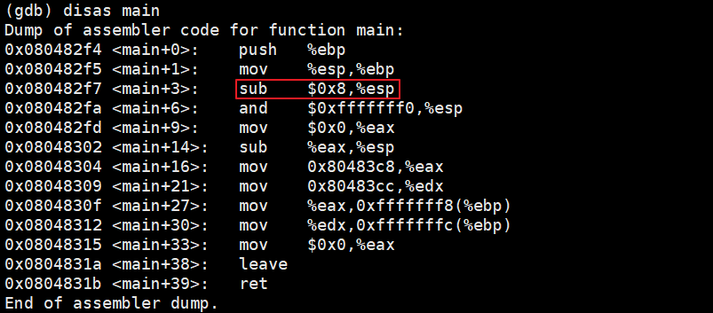
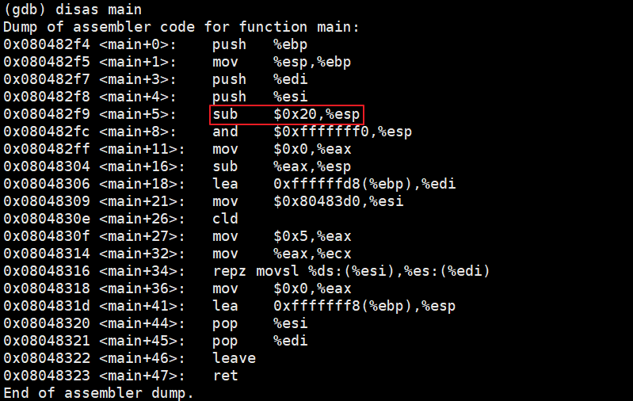
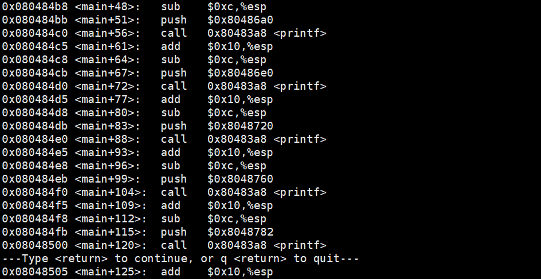
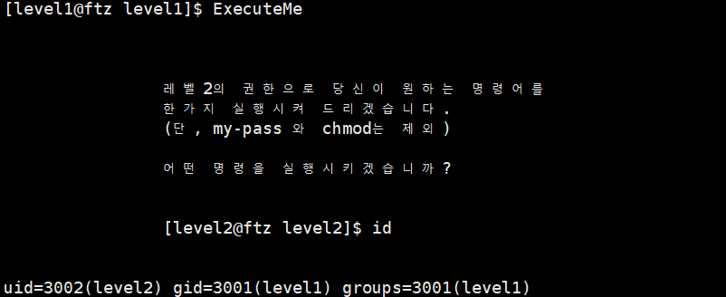

## LEVEL 1


1. hint

   

   

2. level 2 의 권한에 setuid가 걸린 file 찾기

   `find / -type f -perm -4000 -user level2 -ls 2>/dev/null`

   - `-type f` : file 형식

   - `-perm -4000` : setuid

   - `-user level2` : level2 권한

   - `-ls` : 찾은 file을 `ls -li`로 보여줌

   - `2 > /dev/null` : error를 출력하지 않음

     - 이 옵션을 주지 않았을 경우 

     - 옵션 적용 : `Permission denied` 등의 file은 출력하지 않음

       

       

   - setuid bit가 설정되어 있으므로 (s) file을 실행할 때 file 소유자의 권한으로 실행됨

     > setuid bit를 실행 파일에 적용하면 RUID에서 실행 파일 소유자의 ID로 RUID가 변경됨
     
     

-------------------------------


#### 개념 이해


1. dummy

   > FTZ의 RedHat 9.0 : gcc version 3.22

   - gcc 2.96 이상의 상위 버전에서는 stack에 할당되는 buffer의 크기를 16 byte 단위로 맞춰준다
   - 단, 8 byte 이하는 16 byte로 맞추지 않고 8 byte만 할당한다
   - 그리고 뒤에 이어서 8 byte의 dummy byte를 추가한다
   
   
   
   1. 4 byte
      
      > dummy 4 byte + buf 4 byte + SFP 4 byte + RET 4 byte
      
      메모리 구조 :	 |--- 4 ---|--- 4 ---|--- 4 ---|--- 4 ---|
      						+--------+--------+--------+---------+
      						|dummy|    buf    |   SFP   |    RET    |
      						+--------+--------+--------+---------+
      
      ```
      #include <stdio.h>
      
      int main()
      {
      	char buf[4] = "AAA";
      	return 0;
      }
      ```
      
      
      
      ​	→ 버퍼에 8 byte 할당 
      
      
      
      ​	⇒ buf 4 byte ("AAA" + "\0 (null)") + dummy 4 byte 
      
      
      
   2. 8 byte
   
      > buf 8 byte + SFP 4 byte + RET 4 byte
   
      메모리 구조 :	 |------- 8 --------|--- 4 ---|--- 4 ---|
      						+-----------------+--------+---------+
      						|	  	 buf   	   |   SFP   |    RET    |
      						+-----------------+--------+---------+
   
      ```
      #include <stdio.h>
      
      int main()
      {
      	char buf[8] = "AAAAAAA";
      	return 0;
      }
      ```
   
      
   
      ​	→ 버퍼에 8 byte 할당 
   
      
   
      ​	⇒ buf 8 byte ("AAAAAAA" + "\0 (null)") 
   
      
   
   3. 20 byte
   
      > buf 20 byte + dummy 20 byte + SFP 4 byte + RET 4 byte
   
      메모리 구조 :	 |------ 20 -------|------- 20 -------|--- 4 ---|--- 4 ---|
      						+-----------------+-----------------+--------+---------+
      						|	      buf  	     |	    dummy      |   SFP   |    RET    |
      						+-----------------+-----------------+--------+---------+
   
      ```
      #include <stdio.h>
      
      int main()
      {
      	char buf[20] = "AAAAAAAAAAAAAAAAAAA";		// 19
      	return 0;
      }
      ```
   
      
   
      ```
      (gdb) shell python -c 'print 0x20'
      32
      ```
   
       	→ 버퍼에 32 byte 할당
   
      
   
      ​	⇒ dummy 20 byte (8 byte + 12 byte) + buf 20 byte ("AAAAAAAAAAAAAAAAAAA" + "\0 (null)") 
   
      
   
   4. 10 byte + 10 byte
   
      > buf2 10 byte + dummy 6 byte + buf 10 byte + dummy 14 byte + SFP 4 byte + RET 4 byte
   
      메모리 구조 :	 |------ 10 ------|----- 6 -----|------ 10 ------|------ 14 ------|--- 4 ---|--- 4 ---|
      						+---------------+-------------+---------------+---------------+--------+---------+
      						|	     buf2        |   dummy   |	     buf         |      dummy     |   SFP   |    RET    |
      						+---------------+-------------+---------------+---------------+--------+---------+
   
      ```
      #include <stdio.h>
      
      int main()
      {
      	char buf[10] = "AAAAAAAAA";
      	char buf2[10] = "BBBBBBBBB";
      	return 0;
      }
      ```
   
      
   
      ```
      (gdb) shell python -c 'print 0x28'
      40
      ```
   
      ​	→ 버퍼에 40 byte 할당 
   
      
   
      ​	⇒ dummy 8 byte + dummy 6 byte + buf 10 byte("AAAAAAAAA" + "\0 (null)") + dummy 6 byte + buf2 10 byte("BBBBBBBBB" + "\0 (null)") 


-------------------------


#### 문제 분석	


1. `ExecuteMe` 파일을 level 1 권한으로 `tmp` 디렉터리에 복사

   

   - `ExecuteMe` 파일 정보

     

     - `executable` : 실행 파일


2. gdb 분석

   ```
   [level1@ftz tmp]$ gdb -q ExecuteMe
   (gdb) disas main
   ```


​	→ 함수의 시작 부분. 프롤로그


​	→ 0x28 = 40

​	→ 40 byte = 32 byte + 8 byte (dummy)

​    ⇒ `char buf[n];`  (n은 17 이상 32 이하의 정수)


​	→ parameter가 1개이므로, 16 byte로 채워주기 위해 0xc = 12 byte를 빼준다

​	→ 0x8048680에는 문자열이 저장되어 있다

```
(gdb) x/s 0x8048680
0x8048680 <_IO_stdin_used+28>:	 "/usr/bin/clear"
```

​	⇒ `system("/usr/bin/clear");`


```
(gdb) x/s 0x804868f
0x804868f <_IO_stdin_used+43>:	 "/home/level2"
```

​	⇒ `chdir("/home/level2");`




```
(gdb) x/s 0x80486a0
0x80486a0 <_IO_stdin_used+60>:	 "\n\n\n\t\t레벨2의 권한으로 당신이 원하는 명령어를\n"
(gdb) x/s 0x80486e0
0x80486e0 <_IO_stdin_used+124>:	 "\t\t한가지 실행시켜 드리겠습니다.\n"
(gdb) x/s 0x8048720
0x8048720 <_IO_stdin_used+188>:	 "\t\t(단, my-pass 와 chmod는 제외)\n"
(gdb) x/s 0x8048760
0x8048760 <_IO_stdin_used+252>:	 "\n\t\t어떤 명령을 실행시키겠습니까?\n"
(gdb) x/s 0x8048782
0x8048782 <_IO_stdin_used+286>:	 "\n\n\t\t[level2@ftz level2]$ "
```

​	⇒ `printf("\n\n\n\t\t레벨2의 권한으로 당신이 원하는 명령어를\n");`

​		`printf("\t\t한가지 실행시켜 드리겠습니다.\n");`

​		`printf("\t\t(단, my-pass 와 chmod는 제외)\n");`

​		`printf("\n\t\t어떤 명령을 실행시키겠습니까?\n");`

​		`printf("\n\n\t\t[level2@ftz level2]$ ");`


​	→ parameter가 3개이므로, 16 byte로 채워주기 위해 0x4 = 4 byte를 빼준다

​	→ `fgets` 함수의 parameter를 차례대로 stack에 저장

​	→ `fgets` 함수가 키보드로 입력 받은 문자열을 buf에 저장해준다

​    ⇒ `fgets(-40(%ebp), 30, stdin); = fgets(buf, 30, stdin);`


​	→ parameter가 2개이므로, 16 byte로 채워주기 위해 0x8 = 8 byte를 빼준다

​	→ 사용자가 입력한 값이 -40(%ebp), 즉 buf에 있으므로 eax에 넣고, 문자열 0x804879c와 `strstr` 함수로 비교

```
(gdb) x/s 0x804879c
0x804879c <_IO_stdin_used+312>:	 "my-pass"
```

​	⇒ `strstr(buf, "my-pass");`


​	→ eax에 strstr() 함수의 return 값 반환 

> strstr() : 뒷 parameter에 앞 parameter의 값이 있으면 포인터, 없으면 null 반환

​	→ 0이면 (null이면) 0x8048583의 주소로 jump

​	→ 0이 아니면 (buf에 "my-pass"가 있으면) 문자열 0x80487c0 반환하고 exit(0) 실행

```
(gdb) x/s 0x80487c0
0x80487c0 <_IO_stdin_used+348>:	 "\n\t\tmy-pass 명령은 사용할 수 없습니다.\n\n"
```

​	⇒ 

```
if(strstr(buf, "my-pass") != 0)
{
	printf("\n\t\tmy-pass 명령은 사용할 수 없습니다.\n\n");
	exit(0);
}
```


```
(gdb) x/s 0x8048800
0x8048800 <_IO_stdin_used+412>:	 "\n\t\tchmod 명령은 사용할 수 없습니다.\n\n"
```

​	⇒

```
if(strstr(buf, "chmod") != 0)
{
	printf("\n\t\tchmod 명령은 사용할 수 없습니다.\n\n");
	exit(0);
}
```


```
(gdb)x/s 0x8048826
0x8048826 <_IO_stdin_used+450>:	 "\n\n"
```

​	⇒ `printf("\n\n");`


​	→ `shell` 명령어를 통해 gdb 에서 외부 명령어 실행 가능

```
(gdb) shell python -c 'print 0xbba'
3002
```

​	→ `setreuid` 명령어를 통해  RUID와 EUID를 각각 level2(3002)로 바꿔준다

> RUID : Real UID. 실제 사용자 ID → 현재 ID
>
> EUID : Effective UID. 유효 사용자 ID → 현재 권한

​	⇒ `setreuid(3002, 3002);`


​	→ `system` 명령어를 level2의 권한으로 실행한다

​	⇒ `system(buf);`


​	→ 함수의 끝 부분. 에필로그


------------------


#### 의사 코드

> 의사 코드 : 리버스 엔지니어링 / 리버싱. 어셈블리 소스를 원본 소스로 복원하는 과정


```
#include <stdio.h>
#include <unistd.h>
#include <stdlib.h>
#include <string.h>

int main() 
{
    char buf[30];				// 17 이상 32 이하인 정수 모두 가능
    system("/usr/bin/clear");
    chdir("/home/level2");
	
    printf("\n\n\n\t\t레벨2의 권한으로 당신이 원하는 명령어를\n");
    printf("\t\t한가지 실행시켜 드리겠습니다.\n");
    printf("\t\t(단, my-pass 와 chmod는 제외)\n");
    printf("\n\t\t어떤 명령을 실행시키겠습니까?\n");
    printf("\n\n\t\t[level2@ftz level2]$ ");
        
    fgets(buf, 30, stdin); 

    if(strstr(buf, "my-pass") != 0)
    {
        printf("\n\t\tmy-pass 명령은 사용할 수 없습니다.\n\n");
        exit(0);
    }

    if(strstr(cmd, "chmod") != 0) 
    {
        printf("\n\t\tchmod 명령은 사용할 수 없습니다.\n\n");
        exit(0);
    }

    printf("\n\n");
    setreuid(3002, 3002);
    system(buf);
}
```


------------------------


#### 취약점 공략


1. 환경 변수 - PATH

   `echo $PATH`

   

   - `/bin` 이 환경 변수 PATH에 지정되어 있으므로 `/bin`에 있는 파일은 이름만으로 실행 가능

     

2. file (`ExecuteMe`) 실행

   `ExecuteMe`

   - `id`  : level 2 권한 (`uid=3002(level2)`으로 file이 실행된 것 확인

     

   - `/bin/bash`  : level 2 권한으로 shell이 생성되어 떨어짐

     


​		⇒ `ExecuteMe` 실행 후, `/bin/bash` 혹은 `sh` 명령어로 shell을 생성해 `my-pass` 실행 


